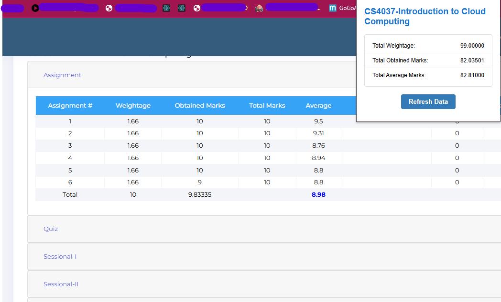

# 🎓 Flex Marks Calculator Extension

This Chrome extension allows you to **calculate your total and average marks** on Flex automatically!

---

## Installation Guide

1. **Download the ZIP file** of the extension.    
[Click here to download the extension ZIP](./Flex%20Extension.zip)
2. **Extract** (unzip) the contents to a folder.
3. Open **Google Chrome** and go to:  
   `chrome://extensions/`
4. **Enable Developer Mode** (toggle at the top-right).
5. Click **"Load unpacked"** and select the extracted folder.
6. Your Flex Marks Calculator should now be installed!

---

##  How to Use

1. Visit your **Flex portal** where your subject marks are visible.
2. Click on the **extension icon** in the Chrome toolbar.
3. The extension will calculate and display:
   - Total Marks
   -  Average Marks

## Preview

---

## 🔄 Troubleshooting

- ❌ **No marks showing?**  
  Click the **"Refresh"** button inside the extension.

- ⚠️ **Something not working?**  
  Just **reload the page**, then try again.

---

## 💡 Tips

- Make sure you are on the **correct Flex page** where all your marks are visible.
- The extension won’t work on unrelated pages.

---

